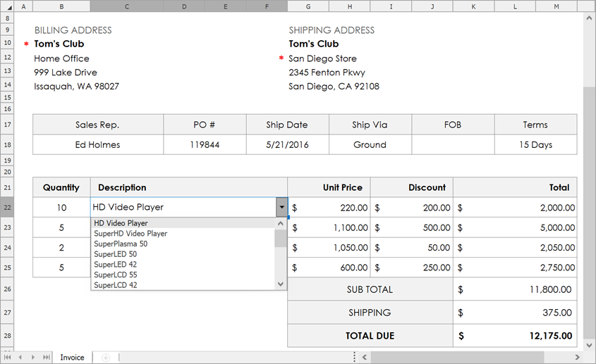

<!-- default badges list -->

<!-- default badges end -->
# How to: Use Custom Cell Editors to Create a Data Entry Form

This example demonstrates how to use custom cell editors to create a data entry form that allows users to quickly generate invoices. The required data entry fields are marked with an asterisk. To add a new record to the invoice or delete the existing one, a user should switch to the **Invoice** tab and click the **Add** or **Remove** button, respectively. All other content is protected to prevent inappropriate modifications.

## Implementation

Data for the invoice is provided based on the document template (_DevAVInvoicing.xltx_), which includes the following worksheets:

- Invoice – contains a sales entry form;
- Customers (hidden) – contains customer info;
- Employees (hidden) – contains a list of employees;
- Products (hidden) – contains product data;
- Stores (hidden) – contains information about stores owned by customers.

To retrieve the required data from worksheets, the Spreadsheet uses the [VLOOKUP](https://support.office.com/en-us/article/VLOOKUP-function-0bbc8083-26fe-4963-8ab8-93a18ad188a1) and [DGET](https://support.office.com/en-us/article/DGET-function-455568bf-4eef-45f7-90f0-ec250d00892e) functions. For example, when a user selects a customer's name in the **Billing Address** section, **VLOOKUP** is used to find and display the customer's billing address. In the same way, the **DGET** function is used to automatically display the shipping address based on the customer's name and the selected city of the store to which the order should be delivered.

## Files to Review

* [Form1.cs](./CS/DevAVInvoicing/Form1.cs) (VB: [Form1.vb](./VB/DevAVInvoicing/Form1.vb))

## Documentation

* [Custom Cell In-place Editors](https://docs.devexpress.com/WindowsForms/18170/controls-and-libraries/spreadsheet/cell-basics/custom-cell-in-place-editors)
